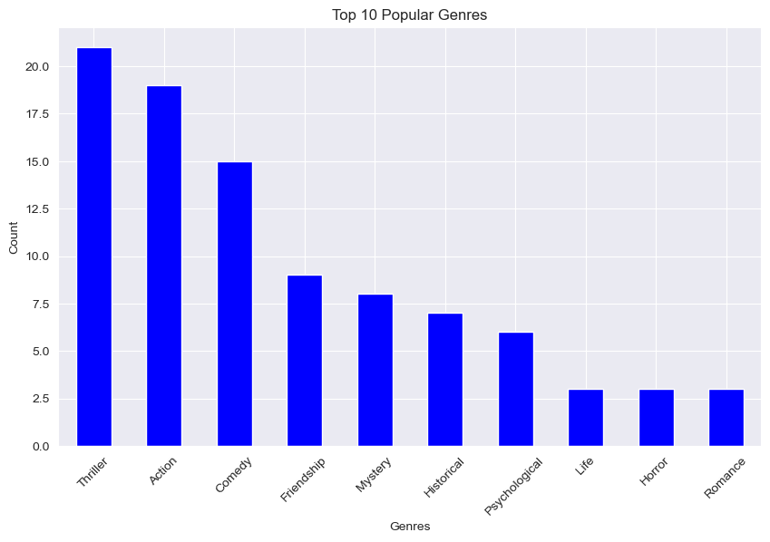
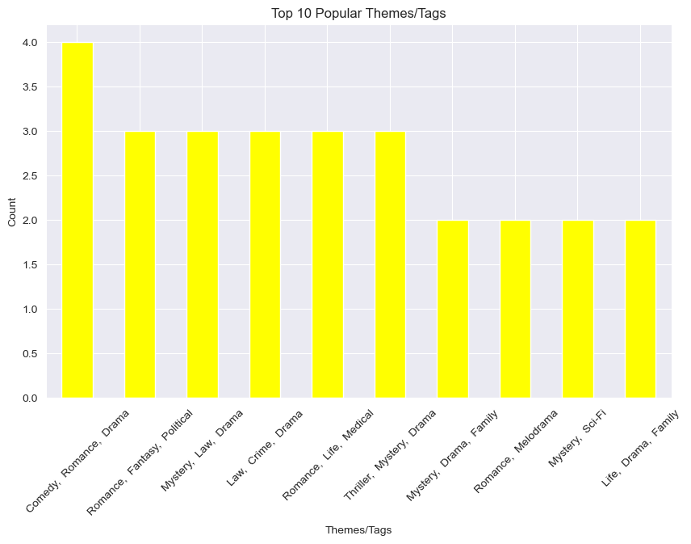
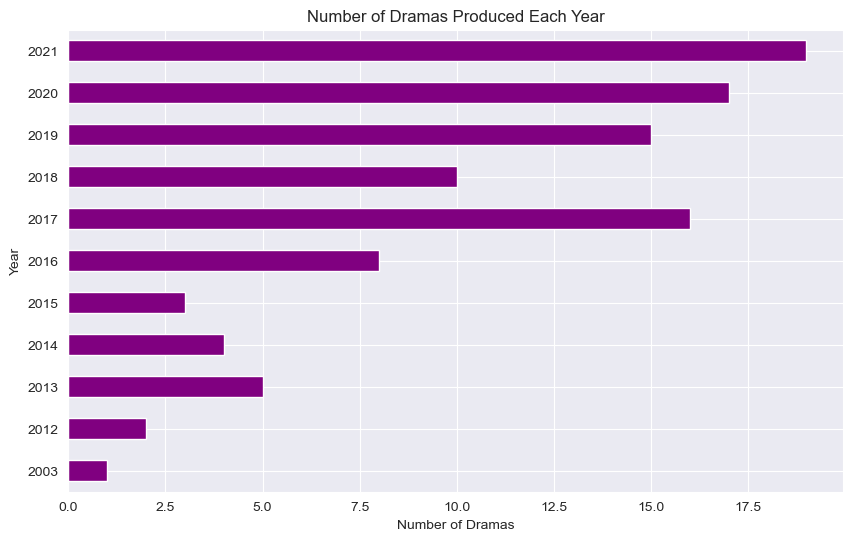
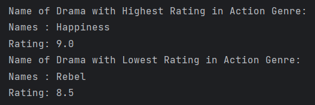
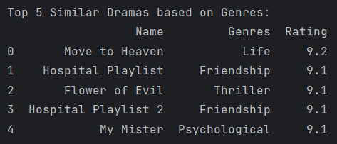

# Korean Drama (K-Drama) - Explanatory Data Analysis 📊

## Project Data Analysis with Python

I analyzed **Top 100 Korean Drama** by Data Visualization with Python.

## Analysis Result

**Popular Genre & Themes**

**Most Production per Year**

**Drama with Highest/Lowest Rating in Action Genre**

**Recommendation System**

**Insight:**
- Most likely, the Korean drama production team will increase production in the Thriller genre.
- With production increasing over the last few years, production in the following year will increase even more.

Unfortunately, I couldn't find data from 2022 to 2023. So, I can't provide more insight. If the data is more complete, then I will add insights based on the results of data visualization that I have obtained based on my knowledge and knowledge.
